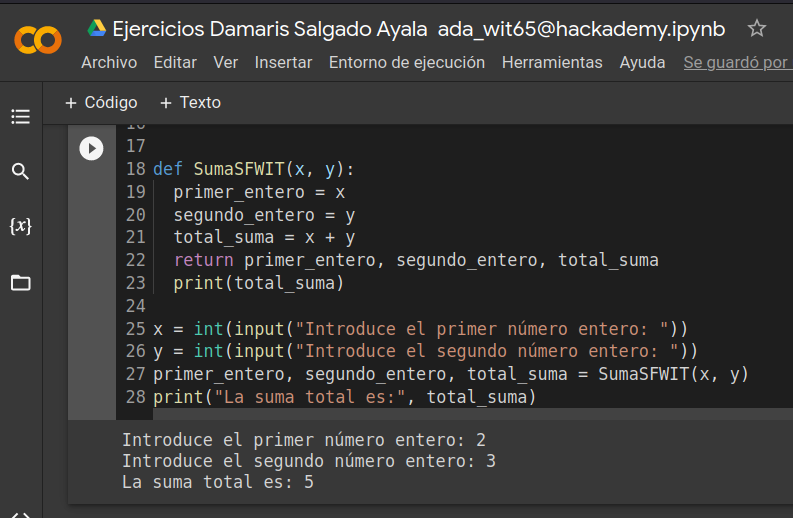

#  ** Suma de 2 números enteros **
==================================

Crea una función que pueda sumar 2 números enteros.
### Prototipo de función:

int sumar(int x, int y); 
Donde,
    **x es el primer número entero**
    **y es el segundo número entero**

### Valor que regresa La suma de los números enteros de arriba

Prueba de entrada

x = 2   
y = 3

Prueba de salida

5

Explicación
La suma de los 2 números enteros x & y se calcula como 2+3=5

*Se realizo el ejercicio en Colab 

Aquí el enlace publico: 

[Aquí el enlace](https://colab.research.google.com/drive 1obkQKQIa8DyL7YVF54YZ34Xyep84TAIU#scrollTo=51_zDnUEVpWE).

.

Siguiendo este procedimiento se llego a realizar la suma solicitada.