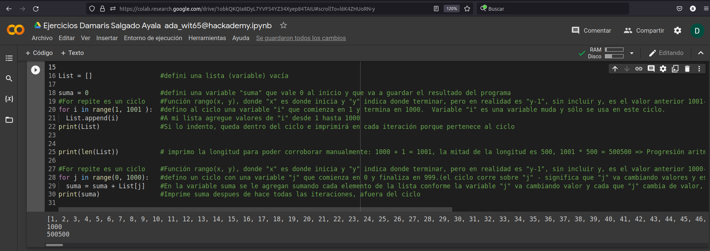

#  Suma de un arreglo de números enteros 
===========================================================================

Teniendo un arreglo de enteros encuentra el resultado de la suma de los elementos del arreglo.

### Reglas:

- 'ar[i]<= 1000 (El arreglo debe de ser menor a mil datos) 
- 'Tienes que crear la función que haga la suma'

### Valor que regresa la suma de los números enteros de arriba:

1. Prueba de entrada

[1,2,3]

2. Prueba de salida

6

3. Explicación:  

La suma de los 3 números enteros se calcula como 1 + 2 + 3 = 5

### Se realizo el ejercicio en Colab

### Aquí el enlace publico: 

### [Visit Colab!](https://colab.research.google.com/drive/1obkQKQIa8DyL7YVF54YZ34Xyep84TAIU#scrollTo=51_zDnUEVpWE).

.

Siguiendo este procedimiento se llego a realizar la suma solicitada.